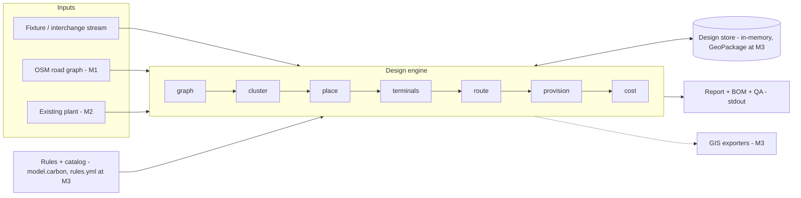

# netwerk — scope

**Status:** v0 (the M0 vertical slice) shipped in this repository · implemented in [Carbon](https://github.com/carbon-language/carbon-lang) · **Doc version:** 0.2 · **Last updated:** 2026-07-28

netwerk is an open-source system that generates outside-plant designs for FTTX networks automatically. Given premises locations, a road network, an equipment catalog, and a set of design rules, it produces a complete draft design — central office selection, cabinet and splitter placement, feeder/distribution/drop routing, cable sizing, and end-to-end logical connectivity — together with a bill of materials, a capex estimate, and exports that open directly in QGIS.

The intended position in the ecosystem: the open, scriptable design engine that sits between raw GIS data and the commercial fiber-management platforms (which document networks but do not design them) and the closed automated-design tools (which design networks but cannot be inspected, extended, or embedded). Everything netwerk reads and writes is an ordinary GIS artifact; everything it decides is driven by user-editable rules; every run is reproducible.

**Implementation status:** netwerk is written in Carbon — [System architecture](#system-architecture) explains why and what that constrains — and this repository ships the M0 vertical slice: the complete pipeline on a synthetic fixture, a deterministic fixture generator, and a byte-exact golden CI gate. Sections describing GIS storage, the multi-verb CLI, and file-based rules are the *target* architecture; wherever shipped v0 differs, the delta is stated in place.

This document is the scope for the project's first releases. It defines the problem, what v1 will and will not do, the data model, the design engine, the architecture, the outputs, and the roadmap. It is a living document: decisions recorded here change by pull request, and the [Open questions](#open-questions) section lists the calls still to be made.

## Contents

- [Background: the FTTX design problem](#background-the-fttx-design-problem)
- [Goals](#goals) · [Non-goals](#non-goals)
- [Users & user stories](#users--user-stories)
- [Requirements](#requirements)
- [Data model & inputs](#data-model--inputs)
- [Design engine](#design-engine)
- [System architecture](#system-architecture)
- [Outputs, exports & QA](#outputs-exports--qa)
- [Roadmap](#roadmap) · [Risks](#risks) · [Open questions](#open-questions)
- [Glossary](#glossary)

## Background: the FTTX design problem

### Outside-plant design, and why it should be automated

Outside plant (OSP) is everything between an operator's central office (CO) and the customer's wall: cables, ducts, poles, cabinets, closures, and the civil works that carry them. An OSP design for a fiber rollout answers, for every premises in a service area: which route the fiber takes, which cabinet and splitter it terminates on, what size every cable is, where every closure sits, and what all of it costs.

Today this is largely manual. A designer in a GIS tool digitizes routes street by street, allocates premises to cabinets by eye, sizes cables from spreadsheets, and iterates until the design passes review. Industry throughput is on the order of hundreds of premises per designer-day, at a design cost commonly quoted at $5–15 per premises passed. A single metro rollout covers 10⁵–10⁶ premises; national programs (US BEAD, EU Gigabit targets, developing-market builds) demand designs for tens of millions of premises on multi-year deadlines. Worse, designs are not produced once: they are re-run for bid estimation, re-scoped when permits fail, and re-optimized as take-up data arrives. Manual design is the bottleneck, and it is also inconsistent — two designers given the same polygon produce materially different networks with materially different costs.

Automation changes the economics twice over. First, it collapses design cost and turnaround from weeks to minutes, making design cheap enough to run speculatively — for market entry screening, bid pricing, and subsidy applications where no one would fund a manual design. Second, an optimizer explores routing and homing combinations no human will, and 5–15% capex reduction on civil works (the dominant cost, typically 60–80% of build cost) dwarfs the design cost itself.

### The network hierarchy

The system must model a five-level tree rooted at the CO. Terminology varies by market; the canonical names used throughout this document:

| Level | Node equipment | Link (cable layer) | Role |
|---|---|---|---|
| Central office (CO) | OLT — *optical line terminal*, the operator-side active equipment | — | Root; source of all fibers and optical signal |
| Feeder | — | Feeder cables (high count, 144–864f) | CO → cabinets; long runs, few routes |
| Cabinet / FDH | FDH — *fiber distribution hub*, a street cabinet housing splitters and a patch field | Distribution cables (12–144f) | Aggregation and (in centralized split) the split point |
| Distribution | Terminals / closures — *splice closures* joining cables, and *access terminals* (MSTs, DPs) exposing drop ports | Drop cables (1–12f) | Terminal → premises; short, per-customer |
| Premises | ONT — *optical network terminal*, the customer-side device | — | Leaf; demand point |

Closures and terminals are first-class objects, not decorations: they carry port capacities, splice costs, and placement constraints (pole vs handhole vs pedestal), and terminal placement drives drop lengths, which drive cost. The design output is therefore a forest of trees — each CO serves a set of cabinets, each cabinet a set of terminals, each terminal a set of premises — overlaid on a shared physical route network.

### FTTX variants in scope

FTTH (fiber to the home) is the primary target: fiber terminates at every premises, and every premises is a demand point of weight 1..n units (a home, or n units in an MDU — *multi-dwelling unit*). FTTB (to the building/basement), FTTC (to the curb/cabinet), and FTTdp (to a distribution point, e.g. for G.fast) are the same problem with the leaf moved up the tree: the "premises" becomes an aggregation node with a demand weight equal to the subscribers behind it, and the copper/coax tail is out of scope. The system models all of these by making the demand point an abstraction with a unit count; no separate code path is needed. FTTT (to the tower) and anchor-institution designs fall out of the same abstraction.

### PON first; point-to-point as a degenerate case

Two access architectures dominate:

- **PON (passive optical network)** — one OLT port serves up to 32–128 premises through passive optical splitters in the field. GPON and XGS-PON (the dominant ITU-T standards: ~2.5 Gb/s shared downstream and 10 Gb/s symmetric, respectively) share identical OSP topology; only optical budgets and OLT/ONT hardware differ. PON is the overwhelming choice for residential FTTH because it minimizes feeder fiber count and CO space.
- **Point-to-point (P2P) Ethernet** — a dedicated fiber per premises from CO to ONT. Simpler logically, far more feeder fiber, used for business services and in some European markets.

The system models **PON first**, because it is the harder, more general case: P2P is exactly a PON with split ratio 1:1 and no splitter hardware, and the data model treats it that way rather than as a separate architecture.

Within PON, splitting is either **centralized** (a single 1:32 or 1:64 split stage in the FDH — every customer is served by a dedicated, unsplit fiber path from cabinet to premises) or **distributed/cascaded** (e.g. 1:4 in a closure, then 1:8 or 1:16 at terminals deeper in the network, multiplying to the target ratio). Centralized splitting is the v1 model: it is the dominant North American/greenfield pattern, keeps the optimization cleanly hierarchical, and maximizes operational flexibility (any port can be patched to any customer). The abstraction generalizes: a split stage is a node attribute (ratio, level), and cascaded splitting becomes a chain of such stages with the constraint that ratios along any root-to-leaf path multiply to the design ratio. Cascaded support is a planned extension, not a redesign. Alternative rejected for v1: modeling arbitrary split placement as a free optimization variable — it explodes the search space for marginal v1 benefit.

### Physical and logical layers are different graphs

Every real OSP tool must maintain a duality the naive model misses:

- The **physical layer**: routes (trench, duct, aerial span), structures (poles, handholes, vaults), cables occupying ducts, closures on cables. Costs live here — digging a meter of trench costs 10–100x the fiber inside it, and a second cable in an existing duct is nearly free.
- The **logical layer**: individual fibers within cables, splices joining fiber to fiber, splitter input/output ports, OLT ports. Connectivity lives here — "premises 4711 is served by splitter 3 port 17 on FDH-12, fed by fiber 88 of feeder cable F-2."

The two layers share geometry but not topology: one duct carries many cables, one cable carries many fibers, one fiber path traverses many cables through splices. The system models both explicitly and keeps them consistent — physical routing decides cost, logical assignment decides capacity and produces the splice schedules and light-path records that make an export usable for construction, not just for a map.

### Design rules the automation must respect

These are the constraints a human reviewer will check first; each is a configurable parameter, not a hardcoded value.

| Rule | Typical value | Treatment in v1 |
|---|---|---|
| Split ratio | 1:32 (GPON), 1:64 (XGS-PON) | Hard constraint per FDH; configurable |
| FDH capacity | 144–576 ports | Hard constraint; drives cabinet count and placement |
| Cable sizes / fiber counts | Discrete catalog (12, 24, 48, 96, 144, 288…f) | Sizing rounds up to catalog sizes; spare-fiber percentage configurable |
| Terminal port count | 4, 8, 12 drop ports | Hard constraint on drop assignment |
| Maximum drop length | 50–150 m (aerial/buried) | Hard constraint premises → terminal |
| Optical budget | ~28 dB (GPON B+), ~29 dB (XGS-PON N1) | **Distance proxy in v1**: max route-meters CO → premises per class. Full dB loss model (per-km, per-splice, per-connector, per-split losses) is a v2 upgrade behind the same constraint interface |
| Homes passed vs connected | Design passes 100% of premises; connects per take rate | Decided v1 default: splitters, feeder fibers, and OLT ports sized against the configured take rate; civil works, distribution, and terminals always sized for 100% so every premises is connectable without new civil work |
| Utilization floor | 95% of installed ports/capacity | Enforced as QA errors per component family (terminals, splitters, FDH cabinets, OLT cards); graduated catalog sizes make the floor reachable |
| Routing rights | Follow roads / rights-of-way only | Hard constraint: routing is on the road/ROW graph, never cross-parcel, except explicit easements provided as input |
| Crossing & surface preferences | Road crossings, rail/water crossings, surface types | Soft constraints via edge cost multipliers in the cost model |
| Existing infrastructure reuse | Ducts, poles, spare fiber | Modeled as low-cost edges/resources with capacity |

The homes-passed/homes-connected distinction deserves emphasis because it shapes the objective: operators build past every premises (homes passed) but only a take-rate fraction subscribe (homes connected). Civil works and distribution cable are sized for 100%; splitters, feeder fibers, and OLT ports can be phased against take-rate. An automated designer that ignores this either overbuilds electronics or underbuilds civils, and both errors are expensive in opposite directions.

### What makes this hard

Strip away the fiber vocabulary and this is a **hierarchical capacitated facility-location problem stacked on a Steiner forest problem**, on real street geometry:

- Choosing FDH locations and assigning premises to them is capacitated facility location — NP-hard.
- Routing feeder and distribution cables to connect chosen facilities along a road graph, sharing trench wherever possible, is Steiner tree/forest with concave (economies-of-scale) edge costs — NP-hard, and harder than the textbook version because cost is dominated by shared civil works, so routes must be optimized jointly, not per-cable.
- The layers are coupled: cabinet placement changes optimal routing, routing changes which cabinet placement is optimal, and discrete cable catalogs and split ratios make the cost function stepwise and non-convex.

No polynomial algorithm solves this exactly; the engineering problem is choosing decompositions and heuristics (cluster-then-route, MILP on reduced graphs, local search) that land within a few percent of optimal at 10⁵-premises scale — this drives the architecture in later sections.

And the inputs are messy: OSM road graphs have broken connectivity and missing paths; address points sit on rooftops rather than at street frontage; existing-duct records are incomplete or wrong; parcel and ROW data varies by jurisdiction. A design that is 2% cheaper but routes through a river loses to one that is buildable. Robustness to imperfect data — snapping, validation, and human-auditable outputs — is as much a part of the problem as the optimization, and the scope below treats it that way.

## Goals

1. **Generate a complete draft outside-plant (OSP) design from open data.** Given premises, an OpenStreetMap road graph, an equipment catalog, and design rules, produce every layer of a fiber-to-the-x (FTTX) design: central office / OLT (optical line terminal — the operator-side endpoint) selection or placement, feeder and distribution routing, FDH (fiber distribution hub — the street cabinet housing splitters) and splitter placement, drop assignment, cable sizing, and end-to-end logical connectivity from OLT port to premises.
2. **Buildable-quality drafts at planning scale.** A run over an area of tens of thousands of premises completes in minutes to a few hours on a laptop and yields a design a human planner would revise, not redo — correct topology, respected capacity and reach constraints, plausible routes on real rights-of-way.
3. **Deterministic, reproducible runs.** Same inputs, configuration, seed, and software version produce the same design, byte-for-byte — the v0 engine is pure integer arithmetic (meters and cents), so identical output holds across platforms, not merely within one. Every run emits a manifest (input hashes, config, versions) sufficient to reproduce it.
4. **Cost-ranked scenario comparison.** Multiple architectures or rule sets (e.g. centralized vs. distributed split, aerial vs. buried bias) run against the same inputs and are compared in a single table: total cost, cost per premises passed, BOM deltas.
5. **Human-in-the-loop refinement.** Any placement or route can be pinned or forbidden by the user; the engine re-solves around the overrides instead of forcing a from-scratch rerun.
6. **First-class interoperability.** Every input, intermediate, and output is an ordinary GIS artifact (GeoPackage by default) that opens in QGIS with no plugin. BOM and cost outputs are plain CSV.
7. **Catalog- and rules-driven, not hard-coded.** Split ratios, cable sizes, cabinet capacities, reach limits, and unit costs live in user-editable configuration, never in code.

## Non-goals

v1 (the release that ships at the end of milestone M2 — see [Roadmap](#roadmap)) deliberately excludes the following. Items marked "later" are plausible for v2+; the rest are permanently out of scope for this project.

- **Inside-plant and in-building design.** No riser diagrams, MDU (multi-dwelling unit) internal wiring, ODF/rack layouts, or headend floor plans. The design terminates at the building entry point / NID.
- **Non-PON, non-fiber access technologies.** No RF/HFC (DOCSIS), fixed wireless, or copper (DSL) planning. Point-to-point Ethernet fiber is supported only as a design-rule variant of the same OSP model.
- **Active equipment configuration.** No OLT provisioning, VLANs, OMCI, service activation, or any interaction with live network elements. Output is a physical/logical design, not device config.
- **Splice-level as-built documentation.** The design records cable-to-cable and port-to-port connectivity, not individual splice trays, fiber colors, or tube assignments. Handoff to a fiber management system (VETRO, IQGeo, 3-GIS class) is via export, not replication of their feature set.
- **Construction and project management.** No scheduling, crew assignment, progress tracking, redlining workflows, or as-built reconciliation.
- **A web GIS editor** (later, as a separate frontend project). v1 is CLI plus the embeddable engine library; QGIS is the viewer/editor.
- **Data procurement and licensing.** The system consumes data the user is entitled to use; it does not scrape parcel data, resolve address licensing, or certify OSM data quality. Fetch helpers for OSM are conveniences, not a data product.
- **Business-case modeling.** No take-rate forecasting, revenue modeling, or financing analysis. Cost outputs are capex estimates from the user's cost model, at planning grade — not contract-bid or permit-submission grade.
- **Survey-grade data correction.** The engine validates and reports input defects; it does not conflate, geocode, or auto-repair authoritative datasets beyond documented, opt-in snapping tolerances.

## Users & user stories

### Persona 1 — Network planner (ISP, utility, or municipal broadband office)

Owns architecture and budget decisions; fluent in FTTX design, moderately fluent in GIS; today works in spreadsheets plus a commercial design tool or consultants.

- As a planner, I want to generate a draft design for a candidate town from OSM roads and a premises file, so that I can put a defensible capex number in a grant application (e.g. BEAD) in a day instead of commissioning a study.
- As a planner, I want to run the same area under three rule sets (1:32 centralized split, 1:32 distributed, aerial-preferred) and see a cost-ranked comparison, so that I can justify the chosen architecture to leadership with numbers.
- As a planner, I want to pin an FDH to the parcel we actually lease and mark a private road as forbidden, then re-run, so that the design converges on something constructable without hand-editing every downstream cable.

### Persona 2 — GIS analyst (data preparation and QA)

Prepares premises, road, and existing-infrastructure layers; expert in QGIS/PostGIS; cares about schemas, CRS handling, and knowing exactly why a run rejected their data.

- As a GIS analyst, I want a published input schema and a validation command that reports every defect (bad CRS, disconnected road subgraphs, premises beyond snap tolerance) with feature IDs, so that I can fix data in QGIS instead of debugging a failed solver run.
- As a GIS analyst, I want every intermediate layer (clusters, candidate sites, routed segments) written as GeoPackage, so that I can visually audit each pipeline stage and catch nonsense early.
- As a GIS analyst, I want existing ducts and poles ingested with per-segment reuse costs, so that brownfield designs prefer infrastructure we already own.

### Persona 3 — Developer / integrator

Embeds the engine in a product or internal pipeline; cares about API stability, determinism for CI, and not being locked to one solver.

- As a developer, I want a documented engine API and CLI with versioned, stable input/output schemas, so that I can wire the engine into our platform without depending on fragile internals.
- As a developer, I want byte-stable outputs for fixed inputs and seed, so that golden-file regression tests in CI catch behavioral changes in my integration.
- As a developer, I want optimization strategies behind a stable interface, so that a MILP refinement backend (or my own heuristic) can be swapped in without touching pipeline code.

## Requirements

### Functional

- **FR-1 Ingest.** Read premises/demand points, road network (OSM extract by default, arbitrary line layers accepted), optional existing infrastructure (ducts, poles, structures with reuse costs), equipment catalog, cost model, and design rules. Formats: the v0 text interchange now; GeoPackage and GeoJSON at M3 (GDAL via C++ interop); PostGIS at M4. Catalog/costs/rules: compiled-in constants in v0, `rules.yml`/`catalog.yml` from M3.
- **FR-2 Validate.** Check CRS, geometry validity, road-graph connectivity, premises snap distance, catalog/rule referential integrity. Emit a machine-readable report (JSON) plus a GIS layer of flagged features. Hard errors stop the run before any solving.
- **FR-3 Cluster.** Partition premises into serving areas respecting FDH/splitter capacity, maximum drop and distribution reach, and natural barriers from the road graph. Boundaries exported as polygons.
- **FR-4 Place.** Select or place the CO/OLT site (from user-supplied candidates or synthesized), FDHs, splitters, and access terminals/closures at rule-permitted candidate locations (road-adjacent, existing structures, user-pinned sites).
- **FR-5 Route.** Compute feeder (CO-to-FDH) and distribution (FDH-toward-premises) routes on the road/ROW graph using per-edge costs (surface type, crossing penalties, existing-infra reuse discounts). Routes are edge sequences on the input graph, never freehand geometry.
- **FR-6 Assign drops.** Connect each premises to a distribution point within drop-length rules; report premises that cannot be served under current rules rather than silently violating them.
- **FR-7 Size and cost.** Select cable sizes and equipment models from the catalog to satisfy fiber-count demand plus configurable spare ratio; produce a bill of materials and capex estimate broken down by category and serving area.
- **FR-8 Export.** Write the full design as GeoPackage layers (physical features + logical connectivity tables keyed by stable IDs), GeoJSON, and CSV (BOM, costs), plus the run manifest. One command, one output directory.
- **FR-9 Compare scenarios.** Compare N completed runs over one input set (each produced by `netwerk design` under a named rules variant); emit a comparison table (total cost, cost/premises, equipment counts, route length by type) referencing the per-scenario full outputs.
- **FR-10 Override and re-run.** Accept pins (fix this site/route), exclusions (never use this edge/parcel), and locks (freeze an entire serving area) as a declarative overrides file; re-solve only what the overrides invalidate where feasible.
- **FR-11 Run manifest.** Every run records input content hashes, full resolved configuration, seed, software and solver versions, and wall-clock per stage.
- **FR-12 Progress & logging.** Structured, leveled logging with per-stage progress (stage, counts, elapsed); `--verbose`/`--quiet` on the CLI; the log is written alongside the run outputs.


### Non-functional

| ID | Requirement | Target |
|----|-------------|--------|
| NFR-1 | Scale | 50k premises end-to-end on a reference laptop (8 cores, 16 GB RAM), no cluster or GPU |
| NFR-2 | Runtime | ≤ 15 min for 10k premises, ≤ 3 h for 50k on the reference laptop, default rules. NFR-1/NFR-2 are provisional until the M2 performance gate validates them on a benchmark fixture |
| NFR-3 | Determinism | Identical geometry/attribute output for identical inputs + config + seed + version; seeds control all stochastic steps |
| NFR-4 | Inspectability | Every pipeline stage's state readable as plain GeoPackage/CSV/JSON; no opaque intermediate formats; a failed run leaves all completed stages on disk |
| NFR-5 | Solver independence | Optimization strategies behind one interface; heuristic implementations ship first and always produce a feasible design with no MIP solver installed; one open MIP backend (HiGHS) as opt-in refinement, a second backend post-v1 to validate the abstraction |
| NFR-6 | Rules-engine test confidence | Rule evaluation, capacity/reach constraints, and QA checks exercised by byte-exact golden designs over ≥ 3 fixture areas in CI; every QA check has a fixture that fails it |
| NFR-7 | Portability | Linux and macOS via the pinned prebuilt Carbon nightly toolchain; Windows when the toolchain supports it; no external services and zero runtime dependencies |
| NFR-8 | Offline operation | After input data is on disk, runs require no network access |

## Data model & inputs

All inputs reduce to five geospatial entity classes plus two configuration files (equipment catalog, design rules). A design run consumes exactly these; anything the optimizer needs that is not listed here is derived, not supplied.

### v0 interchange format (shipped)

Until toolchain file I/O and GDAL interop land (M3), a design run reads one text stream on stdin, and the fixture generator writes the same format on stdout:

```
NETWERK 1
NODES <n>      # then per node:      id x y             (integer meters)
EDGES <m>      # then per edge:      id from to surface  (0 soft, 1 asphalt)
PREMISES <p>   # then per premises:  id x y units
END
```

Coordinates are integer meters in a local planar frame — the degenerate, fully-decided v0 form of the CRS policy below. The GeoPackage schema in this section is the target these same entities migrate into at M3, not a competing design.

### Input entities

**Premises (demand points).** Point geometry, one row per serviceable location. Required: `premises_id`, `geometry`, `units` (homes/households passed, HHP — an MDU building is one point with `units > 1`), `type` (`sfu` | `mdu` | `business` | `anchor`). Optional: `address`, `priority`, `existing_service` flag. Premises are snapped to the road graph at ingest; the snap edge becomes the default drop corridor (the final cable from distribution plant to the premise).

**Road network / permissible routes.** LineString geometry describing where plant may be placed. Required: `edge_id`, `geometry`, `surface_class` (maps to per-meter construction cost: e.g. `soft`, `asphalt`, `concrete`, `aerial`), `crossing_cost_class` for edges that cross rail, water, or highways (a multiplier or fixed penalty applied when a route traverses the crossing). Optional: `oneway` is ignored — fiber routing is undirected. Edges not in this layer are not routable; rights-of-way beyond roads (easements, private land) are expressed by adding edges here.

**Area of interest (AOI).** Single (multi)polygon bounding the design. Everything outside is clipped or rejected at validation. Required: `geometry` only.

**Existing infrastructure (optional).** Ducts, poles, chambers/handholes, and existing spare fiber. All are modeled uniformly as *cost-discounted edges or nodes overlaid on the road graph*: an existing duct with spare capacity is an edge whose per-meter cost is its lease/make-ready cost instead of trenching; a pole line is a chain of aerial edges; a chamber is a node where a closure (a sealed splice enclosure) may be placed at zero civil cost. Required per asset: `asset_id`, `geometry`, `asset_type`, `capacity` (spare duct bores, spare fibers, or pole attachment space), `unit_cost` (the discounted cost of using it). No bespoke solver logic per asset type — the discount model is the contract.

**Candidate structure locations (optional).** Points where cabinets/FDHs (fiber distribution hubs — the field enclosure housing splitters), closures, or the central office may be placed. If absent, candidates are generated automatically along road edges at a configurable spacing (default 50 m) plus at all road nodes and supplied chambers. Required when supplied: `candidate_id`, `geometry`, `allowed_types` (list), optional `site_cost` override.

### Equipment catalog and cost model

The catalog is data, not code: a single editable YAML file (`catalog.yml`) defining a small set of parameterized component types. The solver only ever sees `(component_type, size_parameter, unit_cost)` tuples; adding a vendor-specific cable is a config edit, never a code change.

| Component | Parameter | Cost basis |
|---|---|---|
| `cable` | fiber count (12, 24, 48, 96, 144, 288...) | per meter, plus per-splice labor |
| `splitter` | ratio (1:4, 1:8, 1:16, 1:32, 1:64) | per unit |
| `terminal` | drop port count (4, 8, 12) | per unit + install labor |
| `olt_port` | ports per card/shelf | per port |
| `cabinet` / `fdh` | splitter/port capacity | per unit + install labor |
| `closure` | splice tray capacity | per unit + install labor |
| `duct` | inner diameter / bore count | per meter |
| `trench` | surface class | per meter (civil works, by far the dominant cost) |
| `pole_attachment` | — | per pole (make-ready) |
| `drop` | standard drop assembly | per premise |
| `labor` | activity (splice, blow/pull, test) | per unit or per meter |

Costs are currency-agnostic decimals; the currency label is metadata. Labor and materials are separate line items so BOM (bill of materials) and cost outputs can be re-priced without re-solving.

### Design rules configuration

Design rules live in a documented YAML file (`rules.yml`) checked into the design's working directory. Every key has a default; an empty file is a valid config. Illustrative subset:

```yaml
architecture: gpon-centralized-split   # alt: distributed-split, home-run
splitter_ratio: 32                     # premises per PON port (1:32)
max_premises_per_fdh: 432
max_drop_length_m: 150                 # premise to distribution plant
max_route_length_m: 20000              # OLT to premise, optical budget proxy
take_rate: 0.65                        # fraction of HHP provisioned day-one
spare_fibers_pct: 0.10
utilization_floor: 0.95              # min used/installed per component family, QA-enforced
redundancy:
  feeder_ring: false                   # reserved, post-v1 — v1 feeder routing is always a tree
cost_weights:
  capex: 1.0
  labor_multiplier: 1.0                # regional labor adjustment
candidate_spacing_m: 50
```

Unknown keys are a hard error, not a warning — silent typos in design rules are how bad networks get built.

### Storage and formats

**GeoPackage is the unit of work: one project = one working `.gpkg` file** (exports write a separate design-package `.gpkg` with the stable output schema) containing inputs, intermediate graph, results, and a snapshot of both config files. This makes a design portable, diffable at the layer level, and openable in QGIS with zero setup. PostGIS is a planned M4 backend with the identical schema, targeted at multi-user/service mode; the CLI reads and writes either through the same GDAL-interop I/O layer (M3).

The tables below are the *working* schema inside the project store; the stable exported-layer contract that downstream tools may key on is defined in [Outputs, exports & QA](#outputs-exports--qa). Core layers:

| Layer / table | Geometry | Key columns |
|---|---|---|
| `premises` | POINT | `premises_id`, `units`, `type`, `snap_edge_id`, `assigned_fdh_id` |
| `road_edges` | LINESTRING | `edge_id`, `from_node`, `to_node`, `surface_class`, `length_m`, `cost_per_m`, `existing_asset_id` |
| `road_nodes` | POINT | `node_id`, `degree` |
| `structures` | POINT | `structure_id`, `structure_type` (co/olt, fdh, closure, terminal, chamber, pole), `capacity`, `model_ref` |
| `cables` | LINESTRING | `cable_id`, `fiber_count`, `role` (feeder/distribution/drop), `route_edge_ids`, `model_ref` |
| `ducts` | LINESTRING | `duct_id`, `bore_count`, `occupancy`, `existing` |
| `fibers` | none | `fiber_id`, `cable_id`, `strand_no`, `from_port`, `to_port` — logical connectivity, one row per lit or spare strand path (the per-premises `connectivity` table in [Outputs](#outputs-exports--qa) is a derived view) |
| `equipment` | none | `equipment_id`, `structure_id`, `model_ref`, `qty` (splitters, trays, ports) |
| `design_params` | none | `key`, `value` — frozen copy of `rules.yml` + `catalog.yml` at solve time |
| `results` | none | `metric`, `value` (total cost, cost/HHP, route-meters by surface class, solver gap, runtime) |

Exports: see the authoritative format table in [Outputs, exports & QA](#outputs-exports--qa); BOM and metrics additionally to CSV.

### CRS policy

Ingest any CRS per input file; all internal computation runs in one automatically selected projected CRS — the matching UTM zone of the AOI centroid by default, overridable in `rules.yml` (`crs: EPSG:xxxx`) for jurisdictions with a mandated national grid. Lengths and costs are always computed in projected meters, never geodesic-on-4326. Exports default to the run's working CRS (GeoJSON is always written in EPSG:4326 per its spec), with `--crs EPSG:xxxx` as an override. Mixed-CRS inputs are fine; missing CRS metadata is a validation error, not a guess.

### Acquisition helpers and validation

Two bootstrap commands remove the cold-start problem: `netwerk fetch osm --aoi aoi.gpkg` pulls the road network (and optionally building footprints as premise proxies, centroid + heuristic `units`) from the Overpass/extract ecosystem; `netwerk import premises addresses.csv --x lon --y lat` loads address-point CSVs with column mapping flags. Both write straight into the working store. (Target commands — M1 ships them as offline converters into the interchange format, M3 folds them into the CLI.)

`netwerk validate` runs before any solve and fails fast with actionable, geolocated errors — each finding carries a code, the offending feature ID, and a suggested fix, and is also written to an `issues` layer so it renders in QGIS:

- `E001` invalid geometry (self-intersection, empty, non-simple) — with `--fix` applies `make_valid`
- `E002` premise outside AOI
- `E003` duplicate premise points within tolerance (default 0.5 m)
- `E004` road network not connected: reports component count and the premises stranded on minor components
- `E005` premise farther than `max_drop_length_m` from any routable edge
- `E006` missing/unknown CRS, unknown `surface_class`, or `model_ref` not found in catalog

Warnings (`W...`) cover suspicious-but-solvable data: zero-unit premises, degenerate sliver edges, existing assets with zero capacity. A design solve refuses to start with outstanding errors; warnings require `--allow-warnings`.

## Design engine

The engine is a staged pipeline over a single project database. Each stage consumes validated upstream artifacts and writes its own versioned outputs; **every stage is re-runnable individually with upstream results pinned**. A planner can re-cluster without re-ingesting, or re-route one serving area after manually moving a cabinet, and only downstream stages are invalidated. Stage outputs carry a hash of their inputs, so a stale-upstream re-run is detected, not silently accepted.

### Pipeline

| # | Stage | Input → Output |
|---|-------|----------------|
| 1 | Ingest & validate | Raw GIS layers (premises/demand points, roads and rights-of-way, optional existing ducts/poles), equipment catalog, cost model, design rules → CRS-normalized, schema-validated project database plus a rejection report (unusable geometries, out-of-bounds premises, catalog gaps). |
| 2 | Road-graph construction | Validated road/ROW geometry + premises → noded, routable graph (edges split at intersections, endpoint snapping within tolerance) with per-edge attributes (surface class, existing-infrastructure flags). Each premise is snapped to one or more **drop candidates** — candidate connection points on nearby edges — with drop geometry and length. A *drop* is the final cable from the network to a single premise. |
| 3 | Demand clustering | Graph + snapped premises + design rules → **serving areas**: capacitated clusters respecting max premises per FDH (*fiber distribution hub* — the street cabinet where feeder fibers are split toward premises) and contiguity measured on the graph, not Euclidean distance. |
| 4 | Structure placement | Serving areas + candidate sites (graph nodes, optionally filtered by ROW/placement rules) → one FDH site per serving area (facility location minimizing demand-weighted shortest-path distance); CO/OLT selection from a candidate list if not fixed in the input (*CO* = central office; *OLT* = optical line terminal, the active head-end equipment). |
| 5 | Distribution routing | Per serving area: FDH site + member drop candidates + graph → a distribution tree (Steiner-tree approximation over the road graph) connecting the FDH to every assigned premise, followed by terminal placement: premises grouped onto access terminals/closures at tree nodes respecting terminal drop-port capacity and max drop length, with each drop anchored to its terminal. |
| 6 | Feeder routing | CO/OLT site(s) + FDH sites + graph + capacity rules → feeder routes CO→each FDH, capacity-aware, deliberately overlapping routes to share trench and duct. |
| 7 | Splitter & port assignment | Physical topology + catalog split ratios → the logical layer: splitter placement (*splitter* = passive device dividing one upstream fiber among N subscribers; default centralized split at the FDH), port maps, and a premise→splitter port→OLT port chain for every premise. |
| 8 | Cable sizing & aggregation | Per-edge fiber demand from stages 5–7 + catalog cable sizes → discrete sized cables: individual fiber paths rolled up into catalog cables sharing trench/duct segments, with slack and spare-fiber rules applied. |
| 9 | Costing & BOM rollup | Complete physical + logical design + cost model → bill of materials and itemized capex, broken down by category (trench, cable, hardware, labor) and by serving area. |
| 10 | Outputs & QA | Complete design → GIS exports, reports, and QA checks (full connectivity, no capacity violations, rule compliance) with an explicit pass/fail gate. |

### Algorithms & solver strategy

**Heuristics-first, with optional exact refinement.** Every optimization stage ships a fast heuristic as the default; exact MILP is an opt-in refinement for small instances or final polish. All stages sit behind uniform stage interfaces over the shared Design store, so a stage's implementation (shipped heuristics now; HiGHS-backed MILP refinement via C++ interop at M3) can be swapped without touching pipeline code.

**A global monolithic MILP is explicitly rejected for v1.** Joint clustering + facility location + routing formulations do not scale past a few hundred premises, produce opaque infeasibilities, and are hostile to incremental re-runs and manual overrides. The pipeline decomposes the problem and accepts bounded suboptimality in exchange for solving real-world instance sizes (10⁴–5×10⁴ premises) within the NFR-2 runtime targets (minutes at 10k scale, up to a few hours at 50k).

| Stage | Recommended (v1 default) | Alternative |
|-------|--------------------------|-------------|
| Capacitated clustering (3) | Greedy seeding + local search (swap/relocate moves under capacity and graph-contiguity constraints) | Assignment-MILP refinement of the heuristic solution via HiGHS, behind a flag |
| Facility location (4) | Capacitated k-median-style vertex-substitution heuristic (Teitz–Bart) on graph nodes, multi-restart | Exact MILP via HiGHS for small instances (guideline: ≤5k premises or ≤50 candidate sites) |
| Distribution & feeder routing (5, 6) | Shortest-path Steiner heuristic: Dijkstra/A* from terminals merged into a tree (metric-closure / Mehlhorn-style construction, a 2-approximation), plus key-path local-search improvement | Exact Steiner solvers (SCIP-Jack class) — **out of scope for v1**; edge weights already encode duct-sharing discounts, so feeder overlap falls out of the objective |
| Splitter & port assignment (7) | Deterministic rule-driven assignment following the routed tree | None — no optimization warranted |
| Cable sizing & aggregation (8) | Flow aggregation on the routed tree: accumulate fiber demand leaf→root per edge, map each segment to the smallest covering catalog cable | Small MILP for cable-size selection where catalog price breaks make greedy non-optimal (rare) |

### Optimization objective

One scalarized capex objective, minimized (decomposed) across stages and reported whole:

```
total_capex =   Σ trench_meters(surface_class) × unit_cost(surface_class)
              + Σ cable_meters(cable_type)     × unit_cost(cable_type)
              + Σ hardware_units(sku)          × unit_cost(sku)
              + Σ labor(activity)              × unit_cost(activity)
```

All unit costs and weights come from the cost model config — there are no hard-coded prices. Existing infrastructure is expressed the same way: edges with usable duct or pole get discounted per-meter costs, so "prefer existing duct" needs no special-case logic. Each stage optimizes its local share of this same objective (clustering minimizes a distribution-cost proxy; routing minimizes weighted edge cost), and stage 9 reports the realized total.

Multi-objective optimization (build cost vs. future capacity, opex, resilience/diversity) is **deferred**: v1 reports those dimensions as metrics but does not optimize them. If needed later, they enter as additional weighted terms in the same scalar objective before any true Pareto machinery is considered.

### Determinism, seeds & reproducibility

- **Contract: same inputs + same config + same seed ⇒ identical design outputs** on a given platform and dependency set. Every stochastic component (greedy tie-breaking, local-search move order, k-median restarts) draws from a single seeded PRNG.
- No iteration over unordered containers where order affects results; entities are processed in stable ID order, and all IDs are deterministic functions of input data, never of insertion order.
- Geometry is snapped to a fixed coordinate grid at ingest so graph noding is stable across runs and platforms.
- MILP runs are single-threaded by default with the solver's seed fixed where supported. Near-optimal MILP solutions can still differ across solver *versions*, so tests assert cost-within-tolerance and structural invariants, never solver internals.
- Every run emits a **manifest**: input hashes, config hash, code version, seed, solver name+version per stage, and per-stage timings. The manifest is sufficient to reproduce or audit any design.

### Quality metrics

Computed on every run and exported alongside the design; these are the language for comparing algorithm changes, configs, and competing tools.

| Metric | Definition | What it tells you |
|--------|------------|-------------------|
| Cost per premises passed | total capex ÷ premises inside serving areas | Primary comparator across runs and tools |
| Trench sharing ratio | total cable-meters ÷ total trench-meters | Aggregation quality; higher means better sharing of civil works |
| Average / max drop length | statistics over assigned drop geometries | Cluster and snapping quality; max is a hard-rule check |
| Splitter utilization | assigned ports ÷ installed ports, per FDH and overall | Over/under-provisioning of split capacity |
| Feeder fiber utilization | lit + assigned fibers ÷ cable capacity on feeder segments | Headroom and cable-sizing sanity |

**Baselines and regression.** The repo ships synthetic fixtures (grid town, radial suburb, sparse rural) with committed known-good designs. Golden-file tests assert structural invariants (connectivity, capacity, rule compliance) exactly and total cost within a small tolerance (default ±2%). Where public reference designs or published benchmark instances exist, metric comparisons against them are recorded in CI output. Any change that moves a golden metric beyond tolerance fails CI and requires an explicit, reviewed golden-file update — silent quality drift is not possible.

### Shipped v0 implementation

The pipeline above is implemented end to end in this repository (see [System architecture](#system-architecture) for the language and build story):

| Stage | v0 implementation |
|---|---|
| Ingest & validate | `NETWERK 1` interchange on stdin; sequential-id, range, surface-class, and road-graph-connectivity validation with actionable errors before any solving |
| Road graph | Adjacency lists over fixed-capacity arrays; binary-heap Dijkstra with pluggable weight modes (plain meters vs sharing-aware feeder cents) |
| Snapping | Nearest graph node — the M1 upgrade is edge-splitting drop candidates; node snapping only over-estimates drop lengths, never under |
| Clustering | Farthest-point seeding on graph distance, greedy capacity-respecting assignment (MDUs first), then a rebalance pass that packs serving areas to cabinet capacity — at most one partial cabinet per design; overflow spills and is reported by QA rather than hidden |
| FDH placement | Medoid (unit-weighted 1-median) over each serving area's snap nodes |
| Terminal packing | Premises ordered by DFS position on the distribution tree, cut into full 12-port batches sited at the node minimizing worst drop (shrinking only when the max-drop rule forces it); a merge/shrink repair pass dissolves stragglers; tails close onto 4/8/12-port catalog sizes |
| Distribution routing | Takahashi–Matsuyama Steiner approximation growing a tree from the FDH; per-edge fiber accounting by tree walk, sized for 100% of units |
| Splitters & CO | Take-rate provisioning as full 1:32s plus the smallest covering remainder splitter (1:4/8/16); FDH cabinets sized 144/288/432 per area; CO sited at the splitter-weighted 1-median of FDH sites; OLT line cards (4/8/16-port, minimal covering ports) derived |
| Feeder routing | Sequential nearest-first Dijkstra priced in cents with open-trench discounting — duct/trench sharing falls out of the objective, no special-case logic |
| Cable sizing, BOM, QA | Spare-percent uplift, smallest-covering catalog cable with stacking above 288f, BOM with extended costs, eleven-check QA gate — service rules plus a 95% utilization floor per component family — wired to the process exit code |

Measured on the shipped fixture (9,190 premises / 9,919 households on a 900-node grid town): the full pipeline runs in about half a second, output byte-identical on every run and platform, with component utilization of 96.2% (terminal ports), 97.6% (splitter ports), 99.8% (FDH capacity), and 99.5% (OLT card ports) against the 95% floor. The floor is not fixture luck: verified PASS across three alternative fixture seeds at 10k scale and across town sizes from ~2k to ~7.7k households, and the engine fails fast and honestly on adversarial inputs (out-of-reach premises, duplicate road edges). The local-search refinement passes named in the algorithms table (swap/relocate clustering moves, key-path routing improvement) are M2 scope — what v0 establishes is the end-to-end harness they drop into.

## System architecture

netwerk is implemented in **Carbon** — the experimental successor language to C++ ([carbon-language/carbon-lang](https://github.com/carbon-language/carbon-lang)) — built with the prerelease nightly toolchain. This is a load-bearing decision, not an incidental one. The algorithm core — graphs, clustering, facility location, Steiner heuristics, integer costing — needs only arrays, integers, and control flow, which today's toolchain compiles fast and correctly; and Carbon's C++ interop is the designed route to the geospatial and solver ecosystem (GDAL, PROJ, HiGHS) that no young language has natively, so the ecosystem arrives by interop at M3, never by rewrite. The project doubles as a real-workload exercise of Carbon, in the spirit of the toolchain's own advent-of-code examples.

### What the toolchain gives us — and what it doesn't

The nightly toolchain (pinned; currently `0.0.0-0.nightly.2026.07.27`) compiles a growing but incomplete language subset, and its `Core` library exposes character-level stdin/stdout only. Consequences, embraced rather than fought:

| Toolchain constraint | Consequence in netwerk |
|---|---|
| No file I/O yet | The unit of work is the text interchange format on stdin/stdout; binaries compose as a Unix pipeline |
| No heap containers or allocator API | Fixed-capacity arrays with explicit counts; capacities are compile-time constants in `model.carbon`, all in one place |
| No float printing, minimal string ops | The engine is pure integer arithmetic — meters and cents — which also makes every run byte-identical across platforms |
| No package ecosystem | Zero dependencies beyond the toolchain; GDAL/PROJ/HiGHS arrive at M3 via C++ interop |

GeoPackage/PostGIS storage, YAML rules, and the GIS export contract described elsewhere in this document are the **target architecture**, reachable once toolchain file I/O and C++ interop mature; the interchange format is the v0 stand-in carrying the same information.

### Shipped components

```
netwerk/
├── SCOPE.md               # this document
├── src/
│   ├── io_utils.carbon    # char-level text I/O: int parsing with pushback, printing, money formatting
│   ├── model.carbon       # design rules, equipment catalog + cost model, the Design store, geometry helpers
│   ├── graph.carbon       # adjacency construction, binary-heap Dijkstra, edge-weight modes
│   ├── stages.carbon      # stages 1–7: ingest/validate, snap, cluster, place FDH, terminals, distribution, feeder
│   ├── outputs.carbon     # stages 8–10: cable sizing, BOM/costing, QA gate, report
│   ├── netwerk.carbon     # the design binary: fixture on stdin -> design report on stdout, QA exit code
│   └── gen_fixture.carbon # deterministic synthetic-town generator (the golden-test input)
├── tests/
│   └── golden_report.txt  # committed known-good output of `gen_fixture | netwerk`
├── build.sh               # builds both binaries with the pinned toolchain
└── .github/workflows/ci.yml
```

Two binaries compose the v0 pipeline:

```
./build/gen_fixture | ./build/netwerk
```

`gen_fixture` emits a seeded synthetic town; `netwerk` ingests it, runs every stage, prints the design + BOM + QA report, and exits non-zero if QA fails — the report *is* the machine-readable surface and the CI gate. Stage progress and results print as they compute, so a run is inspectable top to bottom (NFR-4's v0 form).

### The Design store

One `Design` object (`model.carbon`) is the unit of work handed through every stage — the in-memory analogue of the target project GeoPackage: road-graph node/edge arrays, premises with snap and assignment state, serving areas and FDH sites, terminals, per-edge fiber and trench usage, and reusable Dijkstra scratch space. Stages are free functions `Stage(ref d: Design)`; there is no global state, so the engine stays embeddable and testable, and the later service mode wraps the same object.

### Rules and catalog as data

The rules-as-data principle survives translation with one honest v0 caveat: with no file I/O, design rules and the equipment catalog live as named constant functions in `model.carbon` — one file to edit, nothing scattered through pipeline code, and the first thing to migrate to `rules.yml`/`catalog.yml` at M3. Unknown-key rejection and schema validation attach then.

### Target shape: CLI and components

The multi-verb CLI arrives with file I/O; the v0 binary is `design + report + validate` fused. The target contract, unchanged in intent from the original scope:

| Command | Does |
|---|---|
| `netwerk init` | Create a project: working store skeleton, default `rules.yml`, catalog stubs. |
| `netwerk fetch` | Pull open data for the AOI: OSM roads, optionally building footprints as premises proxies. |
| `netwerk import` | Ingest user-supplied premises, roads, existing plant, and catalogs into the store. |
| `netwerk validate` | Check inputs and rules; also runs the design-QA checks against a finished design. |
| `netwerk design` | Run the engine (all stages, or a stage range) and write design layers. |
| `netwerk export` | Emit the design in the formats of the Exports table plus machine-readable BOM. |
| `netwerk report` | Summarize a design: cost breakdown, homes passed/connected, totals, KPIs. |
| `netwerk compare` | Diff completed runs: cost delta, topology delta, changed layers. |



Strategy extensibility (pluggable stage implementations) stays a target: stages already sit behind uniform `Stage(ref d: Design)` signatures, which is the seam a registry attaches to once the toolchain's generics and interfaces settle.

### Builds, testing, and CI

`build.sh` builds both binaries with the pinned toolchain (`carbon build`; whole-program builds run in well under a second). CI downloads the exact pinned nightly release, builds, runs `gen_fixture | netwerk`, asserts the QA exit code, and diffs stdout byte-for-byte against `tests/golden_report.txt` — the golden-file regression harness from the Quality-metrics section, made trivial by integer-deterministic output. Toolchain bumps are deliberate PRs that re-bless the golden file, never ambient drift. Property-style invariant tests (every premises assigned exactly once, capacity never exceeded) currently live inside the QA stage itself, which runs on every design — including in CI.

### Versioning and stability

The interchange format opens with `NETWERK <version>` and is versioned independently of the binaries. The report format is the machine-readable surface until GIS exports land, and changes only with a golden-file re-bless. Once published, releases follow semver; within a major version the CLI surface and interchange schema stay stable, with a one-minor-release deprecation window for anything integrators depend on.

### Licensing

**Apache-2.0 — decided**, matching Carbon's own license and carrying the explicit patent grant that matters in telecom. Future OSM-derived fixtures and example data (test extracts and golden outputs derived from them, arriving at M1) are © OpenStreetMap contributors under ODbL, with attribution in the repo and in generated outputs; the v0 fixture is synthetic and carries no third-party data.

## Outputs, exports & QA

This section defines the **target** output contract (M3, when GDAL interop lands); the shipped v0 emits the report, BOM, and QA subset as structured text — see the worked example below. A design run produces one self-contained design package: geometric layers, a logical connectivity table, tabular rollups (BOM/BOQ, costs), a QA report, and a human-readable summary. Everything lives in one GeoPackage plus sidecar CSV/JSON/HTML files. `netwerk export` writes this design-package `.gpkg` carrying the stable schema below; the working `project.gpkg` remains the in-progress source of truth (its internal schema is in [Data model & inputs](#data-model--inputs)).

### Geometric layers

Layer names and schemas are a stable public contract. Downstream tools (QGIS styles, ETL into GIS-of-record, permit drawings) may key on them; they change only with a schema-version bump (see Exports).

| Layer | Geometry | One row per | Key attributes |
|---|---|---|---|
| `central_offices` | Point | CO / OLT site (placed or selected) | `co_id`, `olt_count`, `ports_used`, `ports_total` |
| `structures` | Point | Cabinet/FDH (fiber distribution hub — the street cabinet housing splitters), access terminal (MST/DP), splice closure, handhole/vault, pole | `structure_id`, `kind`, `model_ref` (catalog key), `capacity`, `occupancy`, `serving_area_id` |
| `route_segments` | LineString | Trench, duct, or aerial span segment used by the design | `segment_id`, `medium` (`buried`/`duct`/`aerial`), `surface_class`, `length_m`, `existing` (bool), `cable_count` |
| `cables` | LineString | Physical cable | `cable_id`, `role` (`feeder`/`distribution`/`drop`), `fiber_count`, `model_ref`, `length_m`, `a_node`, `b_node` |
| `drops` | LineString | Premises drop | `drop_id`, `premises_id`, `structure_id`, `length_m` |
| `serving_areas` | Polygon | FDH serving area | `serving_area_id`, `structure_id`, `premises_passed`, `premises_connected` |
| `premises_out` | Point | Input premises, echoed with assignment | `premises_id`, `serving_area_id`, `drop_id`, `status` (`connected`/`passed`/`excluded`) |

All layers carry `run_id` and are written in the run's working CRS (a projected CRS chosen at ingest); lat/lon exports are reprojected copies.

### Logical connectivity

Fiber-level path per premises, stored as one connectivity table (`connectivity` in the GeoPackage, mirrored to CSV) — not a splice-level model. Per-splice and per-tray detail is explicitly out of scope for v1; the table carries enough to derive splice plans later without re-solving.

| Column | Meaning |
|---|---|
| `premises_id` | Served premises |
| `olt_id`, `olt_port` | Terminating OLT and PON port |
| `feeder_cable_id`, `feeder_fiber` | Feeder cable and fiber index (1-based) |
| `splitter_id`, `splitter_port` | Splitter instance (with `structure_id` join) and output port |
| `dist_cable_id`, `dist_fiber` | Distribution cable and fiber index |
| `drop_id` | Drop assignment |
| `path_length_m` | End-to-end route length CO → premises |

Every row must resolve against the geometric layers; QA enforces referential integrity (below).

### Bill of materials / bill of quantities

Two rollup axes, both emitted: **by component type** (network-wide) and **by serving area**. Line items are priced from the equipment catalog and cost model; quantities are exact from the design, not factored estimates.

- Trench/duct/aerial meters per `medium` × `surface_class` (e.g. `buried/asphalt`, `aerial/existing-pole`).
- Cable meters per `fiber_count` × `role`, including slack/service-loop allowances from design rules.
- Hardware counts: cabinets/FDHs, splitters by ratio, closures, handholes, poles (new), drop terminals, per `model_ref`.
- Labor line items as defined by the cost model (per-meter by surface class, per-unit installs).

Each line: `item`, `unit`, `quantity`, `unit_cost`, `extended_cost`, `cost_stage`. Outputs: `bom.csv`, `bom_by_serving_area.csv`, and the same tables embedded in the summary report.

### Cost outputs

- Total capex, and per-stage breakdown: civil works, feeder, distribution, drops, structures/hardware, labor (stages align with `cost_stage` in the BOM).
- Cost per premises passed and per premises connected — reported side by side, since take-rate assumptions differ per scenario.
- Emitted as `costs.csv` and `costs.json` (machine-readable) and rendered into the summary report. v1 is capex-only; opex/NPV modeling is out of scope.

The **summary report** (`report.md`, rendered to `report.html`) is one page: headline metrics, per-stage cost table, BOM totals, QA verdict, and a static overview map. It is the artifact you attach to a review email.

### Exports

| Format | Status | Notes |
|---|---|---|
| GeoPackage | Native, always written | All layers + tables + metadata in one `.gpkg` |
| GeoJSON | Supported | One file per layer, EPSG:4326, for web-map handoff |
| KMZ | Supported | Styled for field review: structures, routes, serving areas; attribute subset in balloons |
| DXF | **Deferred** | CAD/permit-drawing handoff is post-v1; the stable GeoPackage schema is the interchange point until then |

Every export carries provenance: a `netwerk_meta` table (GeoPackage) or top-level properties (GeoJSON/KMZ) with `schema_version`, `netwerk_version`, `run_id`, timestamp, and a hash of inputs + rules. The output schema is versioned independently of the package (semver: additive columns bump minor, renames/removals bump major) so downstream consumers can gate on it.

### Scenario comparison

`netwerk compare run_a/ run_b/ ...` compares multiple design runs over the same inputs with different rules — e.g. 1:32 vs 1:64 splitting, aerial-preferred vs buried-preferred. It refuses to compare runs whose input hashes differ (override with `--force`, which flags the mismatch in output).

One table, one row per scenario, first run as baseline: total capex, cost per premises passed/connected, trench and cable meters, structure counts, QA verdict — with absolute deltas and percentages vs baseline. Emitted as `compare.csv` and a markdown table. Comparison reads only the stable output schema, so runs from different netwerk versions compare cleanly within a schema major version.

### QA & validation

QA runs automatically at the end of every design and is also available standalone (`netwerk validate design.gpkg`), so hand-edited or externally produced designs can be checked against the same rules.

| Check | Severity |
|---|---|
| `PREMISES_UNSERVED` — a demand premises lacks a complete OLT-port → drop path in `connectivity` | error |
| `CAPACITY_STRUCTURE` — occupancy exceeds catalog capacity (splitter ports, cabinet slots, duct fill) | error |
| `CAPACITY_CABLE` — assigned fibers exceed cable `fiber_count` | error |
| `ROUTE_OFF_GRAPH` — cable or drop geometry leaves the permitted routing graph (beyond snap tolerance) | error |
| `DROP_LENGTH` — drop exceeds the max-drop-length design rule | error |
| `REF_INTEGRITY` — connectivity row references a missing feature, or vice versa | error |
| `ORPHANED_EQUIPMENT` — structure or cable on no premises path | warning |
| `LOW_UTILIZATION` — used/installed below the utilization floor for any component family (terminal ports, splitter ports, FDH capacity, OLT card ports) | error |

Output is `qa_report.json`: per-check status, failing feature IDs (so failures can be selected directly in GIS), counts, and an overall verdict — `pass` (no errors; warnings allowed) or `fail`. The CLI exits non-zero on `fail`, making QA usable as a CI gate. A design run that fails QA still writes all artifacts; the verdict is stamped into `netwerk_meta` and the summary report.

### Worked example (shipped)

The repo ships `gen_fixture`, a seeded synthetic town at 10k-household scale: 9,190 premises (9,919 households) on a 30×30 street grid with asphalt arterials and an MDU district near the center, byte-identical on every run. `./build/gen_fixture | ./build/netwerk` executes the full pipeline in milliseconds and prints the complete v0 design package — serving areas with FDH sites, splitter counts, and feeder lengths; the sized BOM with unit and extended costs; the capex rollup (total, per unit passed, trench-sharing ratio); and the QA report whose verdict drives the exit code. CI diffs this output byte-for-byte against `tests/golden_report.txt`. The OSM-derived town with full GIS outputs described above is the M1–M3 target of this same harness.

## Roadmap

Sequencing only — no calendar dates. **v1 is the release that ships at the end of M2**; M3 and M4 are post-v1. Each milestone is releasable on its own; nothing in M(n+1) begins until M(n)'s exit criteria pass in CI.

| Milestone | Name | Scope | Exit criteria |
|---|---|---|---|
| M0 | Vertical slice — **shipped** | Carbon implementation of the full pipeline on a synthetic fixture: ingest/validate, road graph, capacitated clustering, FDH and terminal placement, Steiner-heuristic distribution, sharing-aware feeder, take-rate splitter provisioning, cable sizing, BOM/costing, QA gate; deterministic fixture generator; CI with byte-exact golden diff. | `gen_fixture \| netwerk` produces a QA-passing design in CI on the pinned toolchain, byte-identical to the committed golden file. **Met by this repository.** |
| M1 | Real-world data | GeoJSON/CSV conversion into the interchange format (stdin until file I/O lands), premises snapping to edge drop-candidates rather than nodes, overrides/pinning (pin CO/FDH sites, forbid edges) as input directives, radial-suburb and sparse-rural fixtures, one OSM-derived town converted offline (ODbL-attributed). | Three synthetic fixtures plus the OSM town pass QA in CI with golden files; a pinned FDH survives re-solve unchanged; drop lengths measurably shorten vs node snapping. |
| M2 | Credible designs — **v1** | Local-search refinement (swap/relocate clustering moves, key-path routing improvement), brownfield reuse via cost-discounted edges, richer catalog (1:64 split, aerial cost classes), per-serving-area BOM, scenario comparison across runs, a performance benchmark fixture. | The OSM-town design is judged revise-not-redo by ≥ 2 OSP practitioner reviewers; refinement improves capex ≥ 3% over M0 greedy on all fixtures; a 10k-premises benchmark meets the NFR-2 budget in CI; the comparison table diffs two rule variants. |
| M3 | Ecosystem bridge | C++ interop: GDAL for GeoPackage/GeoJSON file I/O (this document's target storage contract), PROJ for real CRS handling, HiGHS for opt-in MILP refinement; rules and catalog move from compiled constants to `rules.yml`/`catalog.yml`; multi-verb CLI; HTML design report. | `netwerk design` round-trips the documented GeoPackage schema and opens in QGIS; MILP refinement matches or beats heuristic cost on the benchmark suite; rules edits require no recompile. |
| M4 | Service mode | HTTP API over the library core, async job queue for long solves, PostGIS-backed multi-user storage, authenticated API with per-user project isolation covered by tests and no client-controlled filesystem paths. | Two concurrent users run isolated designs against shared PostGIS; every CLI operation is reachable via the API; a long solve cancels cleanly; auth and isolation tests pass. |

Building the naive-but-complete pipeline (M0) before the optimization work (M2) is deliberate: every solver improvement drops into a working end-to-end harness with golden tests, rather than being built in isolation.

## Risks

| Risk | Likelihood | Impact | Mitigation |
|---|---|---|---|
| Carbon toolchain immaturity: missing features (file I/O, heap containers), nightly regressions, language changes | High | High | Pin the toolchain per release and bump by deliberate PR; stay within the conservative subset the toolchain's own examples exercise; the algorithm layer is language-agnostic and this document is the spec — a port would rewrite syntax, not design |
| Heuristic designs judged "not buildable" by OSP practitioners | Medium | High | The QA rule engine encodes practitioner constraints from M0; overrides/pinning (M1) let planners correct rather than reject; ≥ 2 practitioner reviewers gate the M2 exit |
| No real-world users before significant investment (building in a vacuum) | Medium | High | The M0 slice is public from day one; recruit one design-partner ISP/municipality to run drafts on a real area during M1 and treat their feedback as M2 exit input |
| OSM data quality varies wildly (missing roads, bad connectivity, unmapped private ways) | High | Medium | OSM enters at M1 as one converted input, never a dependency; the validator reports disconnected graphs and stranded premises before any solve |
| Fixed-capacity arrays embarrass real areas (v0 sizes for ~2k premises) | Medium | Medium | Capacities are compile-time constants in one file; per-serving-area decomposition keeps working sets small; heap containers adopted when the toolchain ships them |
| Commercial automated-design tools close the openness gap | Low | Medium | The moat is scriptability, auditability, and open data contracts — publish the interchange and report schemas as stable early |
| Scope creep toward full OSS/BSS (inventory, ticketing, activation) | Medium | High | Non-goals are enforced in triage; exports are the integration boundary — netwerk feeds inventory systems, it never becomes one |
| Single-maintainer bus factor | High | Medium | This SCOPE, uniform stage interfaces, and byte-exact golden tests reconstruct intent; actively promote a second maintainer by M2 |

## Open questions

Decisions still to be made, with the recommended default stated where one exists; each is resolved by a pull request against this document. Resolved in this revision: implementation language (Carbon), license (Apache-2.0), take-rate sizing (decided v1 default), CRS policy (planar integer meters in v0; auto-selected projected CRS at M3), determinism scope (byte-identical across platforms — the integer core makes it free).

1. **File-I/O strategy before M3.** Wait for toolchain file I/O, or bridge earlier with a minimal C-interop shim? Recommended: stdin/stdout pipelines through M1, then reassess against toolchain progress.
2. **Toolchain tracking cadence.** Pin-and-bump per netwerk release (recommended) vs chasing nightlies on a schedule — a stale pin diverges from the language, an eager one destabilizes CI.
3. **Capacity ceilings.** Which compile-time capacities (nodes, edges, premises) must grow before a design-partner area fits, and how far do fixed arrays realistically scale toward the 50k-premises NFR before heap containers exist?
4. **Optical budget depth.** v1 keeps the route-length proxy. Does M3 need real attenuation math (per-km, per-splice, per-split dB, wavelength classes), and per-vendor loss tables or class defaults?
5. **Aerial plant modeling depth.** Cost-class edges with span limits, or genuine pole objects with attachment capacity and make-ready costing? The latter roughly doubles the infrastructure model.
6. **Cascaded split timing.** The model reserves split stages as node attributes; is cascaded-split optimization an M3 item or post-M4? It materially changes the facility-location formulation.
7. **MDU treatment.** A single weighted demand point permanently (recommended), or does per-unit expansion (riser design) ever enter scope? Non-goals currently say never.
8. **"Buildable-quality" acceptance.** Is the QA checklist plus two practitioner sign-offs (the M2 exit) sufficient, or does v1 need a named external design authority?
9. **Golden-file update policy.** When a toolchain or algorithm change legitimately shifts an optimum, who re-blesses the golden file and what evidence must accompany that PR?
10. **Scenario-comparison surface.** A separate `compare` tool reading two reports (recommended for M2) vs teaching the design binary to run N rule variants in one invocation.
11. **Catalog format at M3.** Single YAML file (recommended) or a CSV alternative for cost estimators who live in spreadsheets — decide when rules externalize.

## Glossary

| Term | Definition |
|---|---|
| FTTx | Fiber-to-the-x: family of access architectures (FTTH home, FTTB building, FTTC curb/cabinet) delivering fiber part or all of the way to the subscriber. |
| OSP | Outside plant: the physical network between the central office and the subscriber — cables, ducts, poles, cabinets, closures. |
| OLT | Optical line terminal: the operator-side device (typically in a central office) that terminates and aggregates PON connections. |
| ONT | Optical network terminal: the subscriber-side device terminating the fiber at the premises. |
| PON | Passive optical network: point-to-multipoint architecture where one OLT port serves many ONTs through unpowered optical splitters. |
| GPON | Gigabit PON (ITU-T G.984): the most widely deployed PON standard, ~2.5 Gb/s down / 1.25 Gb/s up shared per port. |
| XGS-PON | 10-Gigabit symmetric PON (ITU-T G.9807.1): successor to GPON, 10 Gb/s symmetric, typically coexisting on the same fiber plant. |
| Splitter | Passive optical component dividing one input fiber across N outputs (1:8, 1:16, 1:32); the split ratio sets how many subscribers share an OLT port. |
| FDH | Fiber distribution hub: street cabinet housing splitters and cross-connect points between feeder and distribution cables; also called a cabinet or LCP. |
| Feeder | High-count cable segment from the central office/OLT to FDHs. |
| Distribution | Mid-count cable segment from an FDH toward premises, terminating at drop points (terminals/closures). |
| Drop | The final short cable from a distribution terminal to an individual premises. |
| HHP / homes passed | Households (or premises) whose frontage the network reaches, whether or not they subscribe; the standard unit for per-premises cost. |
| Take rate | Fraction of homes passed expected to subscribe; drives splitter provisioning and cable sizing. |
| Steiner tree | Minimum-cost tree connecting a set of terminals in a graph, optionally through non-terminal nodes; the core abstraction for feeder/distribution routing. |
| Serving area | The set of premises assigned to one FDH (or one OLT); the primary decomposition unit for clustering, routing, and parallel solves. |
